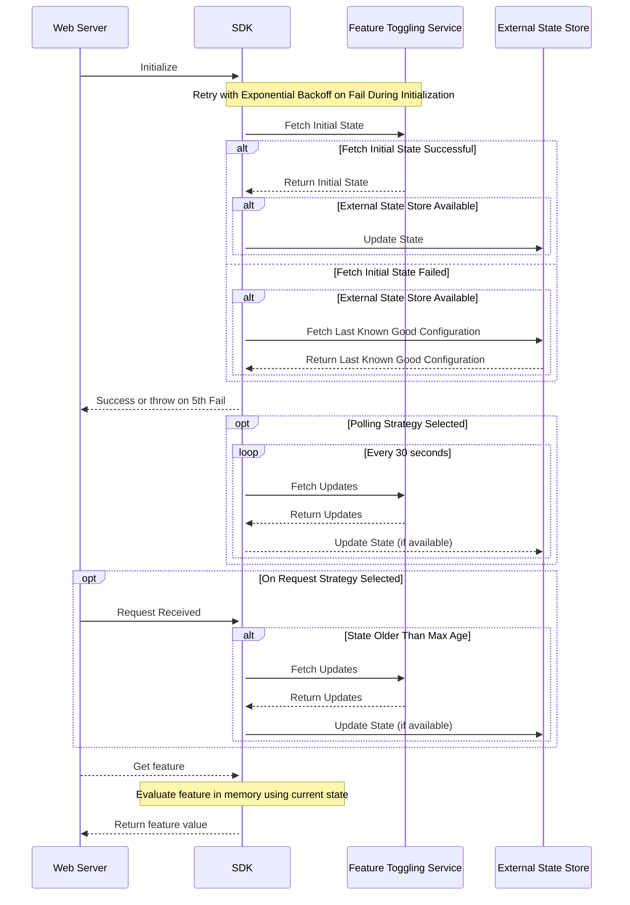

# FeatureBoard SDK High-Level Design

This document describes the high level design of the SDK.

Thanks for the detailed answers. Based on your responses, here is the high-level design document for the feature toggling SDK:

## Architecture

The SDK is primarily composed of an in-memory state store that houses the feature state. It uses a strategy pattern to select the appropriate update strategy. By default, there are "on request" and "polling" strategies available. An external state store can be supplied during the initialization of the SDK, acting as a fallback if the SDK fails to fetch the state from the server.

The following MermaidJS state chart and sequence diagram depict the workflow and interactions within the system:

## Design Considerations

### Initialization Process

The web server must call the feature toggling service to fetch the initial state before starting to listen for requests. If the fetch fails and an external state store is provided, the SDK will attempt to get the last known good configuration from the external state store. If no good configuration is available, initialization will fail.

#### Failure Handling

If the SDK fails to fetch the state from the server, it retries five times with exponential backoff starting from one second. If all attempts fail, the SDK throws an error.

### Update Strategy

By default, the SDK uses a polling strategy for updates. Users can specify a different strategy during initialization. The on-request strategy is primarily meant for serverless environments, and it assumes that each instance will handle a single request at any time. The update is triggered once every 30 seconds to limit server load, with a request timeout of 3 seconds to minimize the impact of slow calls.

The SDK will also offer websocket or server-side events strategy in the future for real-time updates.

### External State Store

The external state store is used as a fallback during initialization. It asynchronously updates when new values are fetched from the feature toggling service.

### Error Handling

The user can subscribe to error notifications to take appropriate actions.

### Security

The communication between the SDK and the server is secured with an API key generated in the admin area of the feature toggling service.

### Concurrency

The on-request strategy is designed for serverless environments where concurrency issues are unlikely. For languages where background processes are not supported (e.g., PHP), a lock mechanism can be implemented to ensure that only one request triggers an update at a time.

### Scalability and Performance

Feature evaluations during a request do not result in an API call and are performed entirely in memory. This ensures high scalability and performance.
