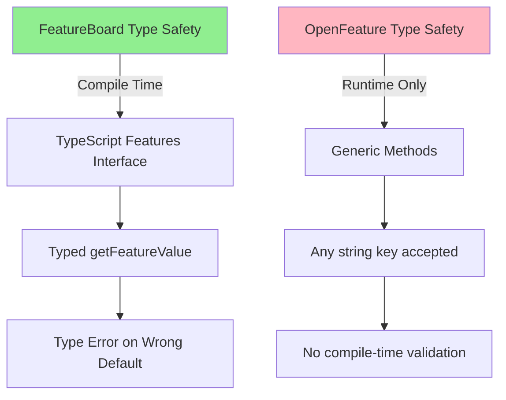
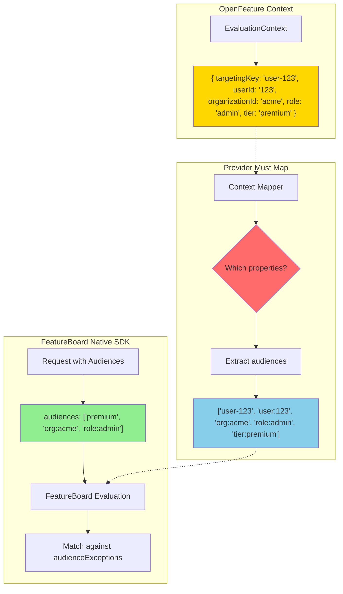
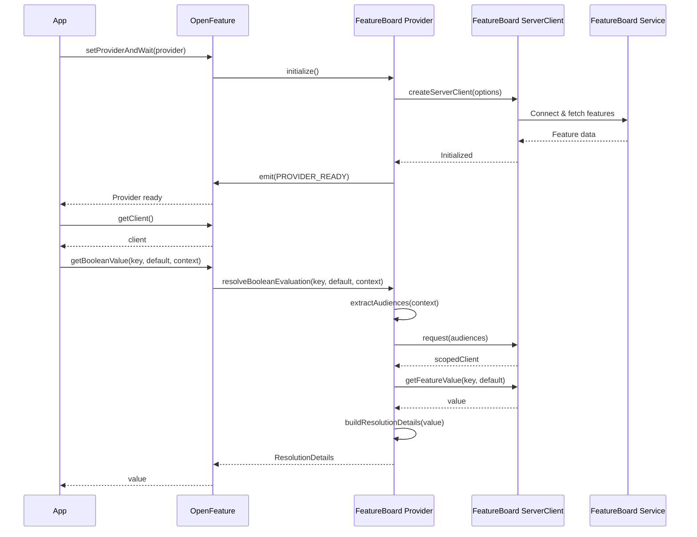
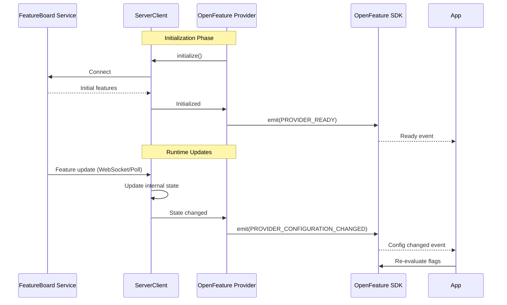
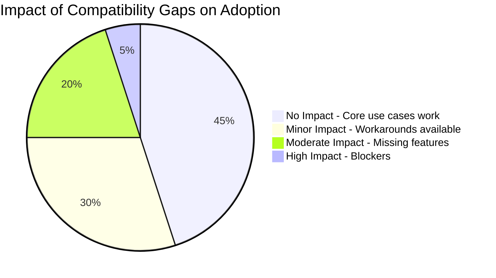

# FeatureBoard to OpenFeature Compatibility Report

**Document Version:** 1.1  
**Date:** January 2, 2026  
**Status:** ✅ Implemented  
**Package:** `@featureboard/openfeature-node-provider`  
**Target SDK:** `@featureboard/node-sdk`

---

## Executive Summary

This report analyzes the compatibility between FeatureBoard and OpenFeature. The **FeatureBoard OpenFeature Provider** has been implemented and provides a bridge between OpenFeature's standardized API and FeatureBoard's feature management platform.

**Architecture Overview:**

```
Application → OpenFeature SDK → FeatureBoard Provider → FeatureBoard node-sdk → FeatureBoard Service
```

### Implementation Status

| Aspect                      | Status             | Notes                                                         |
| --------------------------- | ------------------ | ------------------------------------------------------------- |
| **Overall Compatibility**   | 🟢 **Implemented** | Provider implements all required OpenFeature interfaces       |
| **Core Flag Evaluation**    | 🟢 **Complete**    | Boolean, string, number, object (via JSON strings) supported  |
| **Provider Implementation** | 🟢 **Complete**    | All required provider methods implemented                     |
| **FeatureBoard Features**   | 🟢 **Preserved**   | All FeatureBoard capabilities accessible via context mapping  |
| **OpenFeature Standard**    | 🟢 **Compliant**   | Follows OpenFeature provider specification and best practices |
| **Tests**                   | 🟢 **57 passing**  | Comprehensive test coverage for all components                |

---

## Table of Contents

1. [API Surface Mapping](#api-surface-mapping)
2. [Data Type Compatibility](#data-type-compatibility)
3. [Context & Targeting Mapping](#context--targeting-mapping)
4. [Provider Interface Mapping](#provider-interface-mapping)
5. [Feature Comparison Matrix](#feature-comparison-matrix)
6. [Resolution Details Mapping](#resolution-details-mapping)
7. [Error Handling Mapping](#error-handling-mapping)
8. [Event System Mapping](#event-system-mapping)
9. [Integration Patterns](#integration-patterns)
10. [Compatibility Gaps & Workarounds](#compatibility-gaps--workarounds)
11. [Recommendations](#recommendations)

---

## 1. PRIMARY INCOMPATIBILITY: No Audiences Concept

### 🔴 **The Core Challenge: OpenFeature Has No "Audiences"**

**This is the fundamental incompatibility between FeatureBoard and OpenFeature.**

FeatureBoard uses an **audience-based targeting model** where you explicitly specify which audiences a user belongs to. OpenFeature uses a **context-based model** with arbitrary key-value pairs. **OpenFeature has no concept of "audiences" in its specification.**

### **FeatureBoard: Audience-Based Targeting**

```typescript
// FeatureBoard requires an array of audience strings
const audiences = ['premium', 'beta-users', 'org:acme', 'role:admin']

// Evaluation looks for matching audience exceptions
serverClient.request(audiences)
  .getFeatureValue('feature-1', false)

// Feature configuration in FeatureBoard
{
  featureKey: 'feature-1',
  defaultValue: false,
  audienceExceptions: [
    { audienceKey: 'premium', value: true },      // Matches 'premium'
    { audienceKey: 'role:admin', value: true }    // Matches 'role:admin'
  ]
}
```

### **OpenFeature: Context-Based Targeting**

```typescript
// OpenFeature uses EvaluationContext - a flat key-value object
// Contains properties ABOUT the user, but doesn't declare membership
const context = {
  targetingKey: 'user-123', // PRIMARY: Who is being evaluated (REQUIRED for targeting)

  // Additional properties that describe the user/request
  userId: '123',
  email: 'user@example.com',
  organizationId: 'acme',
  role: 'admin',
  tier: 'premium',
  country: 'US',
  betaProgram: true,
  // ... any arbitrary properties
}

// The PROVIDER interprets this context to determine the flag value
client.getBooleanValue('feature-1', false, context)
```

**Key Difference in Philosophy:**

| Aspect                      | FeatureBoard (Audience-Based)                                            | OpenFeature (Context-Based)                                             |
| --------------------------- | ------------------------------------------------------------------------ | ----------------------------------------------------------------------- |
| **What you provide**        | **Explicit membership list** - "user belongs to these groups"            | **Properties about the user** - "here's what we know about the user"    |
| **Example input**           | `['premium', 'org:acme', 'role:admin']`                                  | `{ tier: 'premium', organizationId: 'acme', role: 'admin' }`            |
| **Who decides flag value?** | FeatureBoard service checks if any audience matches `audienceExceptions` | **Provider decides** how to interpret context                           |
| **Semantic**                | "Is user IN any of these audiences?"                                     | "Given this information about the user, what should the flag value be?" |
| **Standard**                | FeatureBoard-specific concept                                            | OpenFeature standard, but interpretation varies by provider             |

### **The Problem**

| Aspect           | FeatureBoard                 | OpenFeature                         | Incompatibility         |
| ---------------- | ---------------------------- | ----------------------------------- | ----------------------- |
| **Input Format** | Array of strings `string[]`  | Object `{ [key: string]: any }`     | 🔴 Different structure  |
| **Semantic**     | Explicit audience membership | Property-based context              | 🔴 Different meaning    |
| **Standard**     | FeatureBoard-specific        | OpenFeature standard (no audiences) | 🔴 Must invent mapping  |
| **Matching**     | Exact string match on array  | Provider-specific interpretation    | 🔴 No standard approach |

### **What OpenFeature Uses Instead of Audiences**

OpenFeThe Translation Challenge\*\*

The provider must translate OpenFeature's **"properties about a user"** into FeatureBoard's **"list of groups the user belongs to"**.

**Critical Questions the Provider Must Answer:**

1. **How to interpret property values as audience membership?**

   ```typescript
   // Context property          → Audience string?
   tier: 'premium'             → 'premium'? or 'tier:premium'?
   role: 'admin'               → 'admin'? or 'role:admin'?
   organizationId: 'acme'      → 'acme'? or 'org:acme'?
   isPremium: true             → 'premium'? or 'isPremium:true'?
   betaProgram: true           → 'beta'? or 'beta-users'? or 'betaProgram'?
   ```

2. **Which properties represent audience membership vs. metadata?**

   ```typescript
   {
     userId: '123',          // ❓ Is this an audience?
     email: 'u@ex.com',      // ❓ Probably not an audience
     role: 'admin',          // ✅ Probably an audience
     lastLoginDate: '...',   // ❌ Not an audience
     organization: 'acme',   // ✅ Probably an audience
     sessionId: 'xyz'        // ❌ Not an audience
   }
   ```

3. **What about targetingKey?**

   ```typescript
   targetingKey: 'user-123'  → Include as audience 'user-123'?
                              → Or just for logging/debugging?
                              → Or extract ID and make 'user:123'?
   ```

4. **How to handle non-string values?**

   ```typescript
   isPremium: true          → 'premium'? or 'isPremium'? or skip?
   subscriptionLevel: 3     → 'level:3'? or 'level-3'? or skip?
   features: ['a', 'b']     → Multiple audiences? or skip?
   ```

5. **How to maintain backwards compatibility?**
   - Existing FeatureBoard configs use audience strings like `'premium'`, `'org:acme'`, `'role:admin'`
   - OpenFeature context must reconstruct these **exact strings**
   - Otherwise, existing feature configurations won't match

```typescript
// FeatureBoard: Explicit "this user IS IN these groups"
audiences: ['premium', 'org:acme', 'beta-users']
// ✅ Clear: check if 'premium' matches any audienceException

// OpenFeature: "Here are facts about the user"
context: { tier: 'premium', organizationId: 'acme', betaProgram: true }
// ❓ Provider must decide: Does this mean user is in 'premium' audience?
//    Does 'organizationId: acme' mean 'org:acme' audience?
//    Does 'betaProgram: true' mean 'beta-users' audience?
```

**Core Issue**: OpenFeature provides **descriptive properties**, not **membership declarations**. The FeatureBoard provider must **reverse-engineer audience membership** from these properties. **There is no standard way to do this.**

### **Critical Questions the Provider Must Answer**

1. **Which context properties become audiences?**

   - Should `userId: '123'` become audience `'123'` or `'user:123'`?
   - Should `role: 'admin'` become `'admin'` or `'role:admin'`?

2. **How to handle non-string values?**

   - What if `tier: 'premium'` vs `isPremium: true`?
   - What about numbers: `score: 100`?

3. **How to handle nested or complex values?**

   - What if context has `user: { id: '123', role: 'admin' }`?
   - Should nested properties be flattened?

4. **What about arbitrary custom properties?**

   - User adds `customSegment: 'vip'` - should this become an audience?
   - How to distinguish targeting properties from metadata?

5. **How to maintain backwards compatibility?**
   - Existing FeatureBoard configurations use audience strings like `'premium'`, `'org:acme'`
   - These exact strings must be reconstructable from OpenFeature context

### **Solution Strategies**

| Strategy                           | Description                                                                   | Pros                                                                                     | Cons                                                                                       | Recommended                   |
| ---------------------------------- | ----------------------------------------------------------------------------- | ---------------------------------------------------------------------------------------- | ------------------------------------------------------------------------------------------ | ----------------------------- |
| **1. Custom `audiences` property** | `context.audiences: string[]`                                                 | ✅ Explicit<br>✅ No ambiguity<br>✅ Direct pass-through                                 | 🔴 Non-standard OpenFeature<br>🔴 Vendor-specific                                          | ⭐⭐⭐⭐⭐ **PRIMARY**        |
| **2. Configurable property map**   | User provides map<br>`{ tier: 'tier:{value}' }`<br>Provider applies templates | ✅ Declarative<br>✅ Easy to configure<br>✅ No code required<br>✅ Handles common cases | 🔴 Template syntax required<br>🔴 Limited to string templates                              | ⭐⭐⭐⭐⭐ **RECOMMENDED**    |
| **3. Property name mapping**       | Map known properties<br>`userId → 'user:{value}'`<br>`role → 'role:{value}'`  | ✅ Predictable<br>✅ Documented<br>✅ Works for common cases                             | 🔴 Limited flexibility<br>🔴 Must know all property names<br>🔴 Naming convention required | ⭐⭐⭐⭐ **DEFAULT FALLBACK** |
| **4. Custom mapper function**      | User provides function<br>`(ctx) => string[]`                                 | ✅ Maximum flexibility<br>✅ User control<br>✅ Handles any logic                        | 🔴 Requires code<br>🔴 Learning curve<br>🔴 More complex setup                             | ⭐⭐⭐ **ADVANCED**           |
| **5. targetingKey only**           | Use `context.targetingKey` as single audience                                 | ✅ OpenFeature standard                                                                  | 🔴 Only one audience<br>🔴 Loses FeatureBoard power                                        | ⭐ Not recommended            |
| **6. Scan all properties**         | Convert all string properties to audiences                                    | ✅ No configuration                                                                      | 🔴 Unpredictable<br>🔴 May include unwanted data<br>🔴 Unreliable                          | ❌ Not recommended            |

### **Recommended Implementation: Hybrid Strategy**

````typescript
function extractAudiences(context: EvaluationContext): string[] {
  // Strategy 1: Explicit audiences (RECOMMENDED - clearest)
  if (context.audiences && Array.isArray(context.audiences)) {
    return context.audiences as string[]
  }

  // Strategy 2: Property mapping (FALLBACK - for standard cases)
  const audiences: string[] = []

  // Include targetingKey as-is (OpenFeature standard)
  if (Real-World Example: The Mismatch**

```typescript
// In FeatureBoard service, you configure:
{
  featureKey: 'premium-features',
  defaultValue: false,
  audienceExceptions: [
    { audienceKey: 'premium', value: true },
    { audienceKey: 'org:enterprise-co', value: true }
  ]
}

// FeatureBoard Native SDK - Explicit membership declaration
const audiences = ['premium', 'org:enterprise-co']
const client = serverClient.request(audiences)
const value = client.getFeatureValue('premium-features', false)
// ✅ FeatureBoard checks: Is 'premium' in audiences? YES → return true

// OpenFeature - Descriptive properties
const context = {
  targetingKey: 'user-456',
  subscriptionTier: 'premium',        // ❓ Is this 'premium' audience?
  organizationName: 'enterprise-co'   // ❓ Is this 'org:enterprise-co' audience?
}
const value = await client.getBooleanValue('premium-features', false, context)
// ❓ Provider must decide:
//    - Does subscriptionTier: 'premium' mean user is in 'premium' audience?
//    - Does organizationName: 'enterprise-co' mean 'org:enterprise-co' audience?
//    - How to construct the exact strings FeatureBoard expects?
````

### **Impact on Users**

This is **THE main friction point** for users:

```typescript
// FeatureBoard Native SDK - Declare audience membership
const audiences = ['premium', 'org:acme', 'role:admin']
const client = serverClient.request(audiences)
const value = client.getFeatureValue('feature', false)
// ✅ Crystal clear: user belongs to these audiences

// OpenFeature Option 1: Custom audiences array (RECOMMENDED)
const context = {
  targetingKey: 'user-123',
  audiences: ['premium', 'org:acme', 'role:admin'], // ⚠️ FeatureBoard-specific
}
const value = await client.getBooleanValue('feature', false, context)
// ⚠️ Must know: 'audiences' is a custom convention, not OpenFeature standard

// OpenFeature Option 2: Property mapping (IMPLICIT)
const context = {
  targetingKey: 'user-123',
  tier: 'premium', // ⚠️ Provider translates to 'premium' or 'tier:premium'?
  organizationId: 'acme', // ⚠️ Provider translates to 'org:acme'?
  role: 'admin', // ⚠️ Provider translates to 'role:admin'?
}
const value = await client.getBooleanValue('feature', false, context)
// ⚠️ Must understand provider's mapping rules
```

**Users must understand:**

1. **OpenFeature provides properties, not audience membership** - fundamentally different model
2. **FeatureBoard provider needs to bridge this gap** with mapping conventions
3. **Recommended approach**: Use explicit `context.audiences` array (FeatureBoard-specific)
4. **Alternative**: Learn the property→audience mapping rules (e.g., `organizationId → 'org:{value}'`)
5. **Advanced**: Provide custom `audienceMapper` function for complex business logic
6. **Critical**: Context properties must produce the **exact audience strings** used in FeatureBoard configs

```typescript
// FeatureBoard Native SDK - Clear and explicit
const audiences = ['premium', 'org:acme', 'role:admin']
const client = serverClient.request(audiences)
const value = client.getFeatureValue('feature', false) // ✅ Clear what audiences are used

// OpenFeature Provider - Must understand mapping
const context = {
  audiences: ['premium', 'org:acme', 'role:admin'], // ⚠️ FeatureBoard-specific convention
}
const value = await client.getBooleanValue('feature', false, context)

// OR using property mapping
const context = {
  organizationId: 'acme', // ⚠️ Must know this becomes 'org:acme'
  role: 'admin', // ⚠️ Must know this becomes 'role:admin'
}
```

**Users must understand:**

1. OpenFeature has no concept of "audiences" - this is FeatureBoard-specific
2. How to construct context to match their FeatureBoard audience strings
3. The naming conventions (e.g., `'user:{userId}'`, `'org:{organizationId}'`)
4. That `context.audiences` is a **custom FeatureBoard convention**, not OpenFeature standard
5. Alternative: provide custom `audienceMapper` function for complex logic

---

## 2. API Surface Mapping

### 1.1 Core Evaluation Methods

| OpenFeature Method                       | FeatureBoard Equivalent         | Compatibility | Notes                                                 |
| ---------------------------------------- | ------------------------------- | ------------- | ----------------------------------------------------- |
| `getBooleanValue(key, default, context)` | `getFeatureValue(key, default)` | 🟢 **100%**   | Direct mapping, type matches                          |
| `getStringValue(key, default, context)`  | `getFeatureValue(key, default)` | 🟢 **100%**   | Direct mapping, type matches                          |
| `getNumberValue(key, default, context)`  | `getFeatureValue(key, default)` | 🟢 **100%**   | Direct mapping, type matches                          |
| `getObjectValue(key, default, context)`  | `getFeatureValue(key, default)` | 🟢 **100%**   | Provider parses JSON strings to objects               |
| `getBooleanDetails(...)`                 | Constructed by provider         | 🟢 **100%**   | Provider constructs ResolutionDetails                 |
| `getStringDetails(...)`                  | Constructed by provider         | 🟢 **100%**   | Provider constructs ResolutionDetails                 |
| `getNumberDetails(...)`                  | Constructed by provider         | 🟢 **100%**   | Provider constructs ResolutionDetails                 |
| `getObjectDetails(...)`                  | Constructed by provider         | 🟢 **100%**   | Provider parses JSON and constructs ResolutionDetails |

### 1.2 Client Creation & Lifecycle

| OpenFeature Pattern                | FeatureBoard Pattern                | Compatibility | Mapping Strategy                                    |
| ---------------------------------- | ----------------------------------- | ------------- | --------------------------------------------------- |
| `OpenFeature.setProvider()`        | `createServerClient()`              | 🟢 **100%**   | Provider wraps ServerClient                         |
| `OpenFeature.setProviderAndWait()` | `serverClient.waitForInitialised()` | 🟢 **100%**   | Direct mapping                                      |
| `OpenFeature.getClient()`          | `serverClient.request(audiences)`   | 🟡 **80%**    | Requires context-to-audience mapping                |
| `client.addHandler(event)`         | ❌ No direct equivalent             | 🟡 **70%**    | Can emit OpenFeature events from FeatureBoard state |
| `OpenFeature.close()`              | `serverClient.close()`              | 🟢 **100%**   | Direct mapping                                      |

### 1.3 Code Comparison

#### FeatureBoard Current Pattern

```typescript
// Setup
const serverClient = createServerClient({
  environmentApiKey: 'env-key',
  updateStrategy: 'polling',
})
await serverClient.waitForInitialised()

// Per-request usage
app.get('/api', (req, res) => {
  const audiences = extractAudiences(req)
  const client = serverClient.request(audiences)

  const isEnabled = client.getFeatureValue('new-ui', false) // Sync
  const maxItems = client.getFeatureValue('max-items', 10)
})
```

#### OpenFeature Pattern

```typescript
// Setup
await OpenFeature.setProviderAndWait(
  new FeatureBoardProvider({
    environmentApiKey: 'env-key',
    updateStrategy: 'polling',
  }),
)

// Per-request usage
app.get('/api', async (req, res) => {
  const context = buildContext(req)
  const client = OpenFeature.getClient()

  const isEnabled = await client.getBooleanValue('new-ui', false, context) // Async
  const maxItems = await client.getNumberValue('max-items', 10, context)
})
```

#### Key Differences

| Aspect    | FeatureBoard                        | OpenFeature           | Impact                                |
| --------- | ----------------------------------- | --------------------- | ------------------------------------- |
| **Async** | Optional (sync for most strategies) | Always required       | More verbose, potential perf overhead |
| **Scope** | Request-scoped client               | Context per call      | Need to pass context repeatedly       |
| **Setup** | Direct client creation              | Provider registration | Extra abstraction layer               |

---

## 2. Data Type Compatibility

### 2.1 Value Type Support Matrix

| Type        | FeatureBoard      | OpenFeature      | Compatibility | Mapping Strategy                        |
| ----------- | ----------------- | ---------------- | ------------- | --------------------------------------- |
| **Boolean** | ✅ `boolean`      | ✅ `boolean`     | 🟢 **100%**   | Direct pass-through                     |
| **String**  | ✅ `string`       | ✅ `string`      | 🟢 **100%**   | Direct pass-through                     |
| **Number**  | ✅ `number`       | ✅ `number`      | 🟢 **100%**   | Direct pass-through                     |
| **Integer** | ✅ `number`       | ✅ `number`      | 🟢 **100%**   | JS number works for both                |
| **Float**   | ✅ `number`       | ✅ `number`      | 🟢 **100%**   | JS number works for both                |
| **Object**  | ⚠️ As JSON string | ✅ `JsonValue`   | 🟢 **100%**   | Provider parses JSON strings to objects |
| **Array**   | ⚠️ As JSON string | ✅ `JsonValue[]` | 🟢 **100%**   | Provider parses JSON strings to arrays  |
| **Null**    | ❌ Not supported  | ✅ `null`        | 🟡 **50%**    | Returns DEFAULT reason                  |

**Note on Object/Array Support:** FeatureBoard stores complex values as JSON strings (e.g., `'{"key":"value"}'`). The provider automatically parses these when `resolveObjectEvaluation()` is called, providing seamless object support.

### 2.2 Type Safety Analysis



#### Type Safety Comparison

| Feature                    | FeatureBoard        | OpenFeature             | Migration Impact                |
| -------------------------- | ------------------- | ----------------------- | ------------------------------- |
| **Feature Key Validation** | ✅ Compile-time     | ❌ Runtime only         | High - loses type safety        |
| **Value Type Matching**    | ✅ Enforced         | ⚠️ By convention        | High - potential runtime errors |
| **Autocomplete**           | ✅ Full IDE support | ⚠️ String keys only     | Medium - reduced DX             |
| **Refactoring Safety**     | ✅ Type-checked     | ❌ String search needed | High - more error-prone         |

**Example Type Safety Loss:**

```typescript
// FeatureBoard - Type safe
declare module '@featureboard/js-sdk' {
  interface Features {
    'max-items': number
  }
}

client.getFeatureValue('max-items', false) // ❌ Compile error - wrong type!
client.getFeatureValue('max-itemz', 10) // ❌ Compile error - typo!

// OpenFeature - No compile-time checks
await client.getBooleanValue('max-items', false) // ✅ Compiles but wrong type
await client.getNumberValue('max-itemz', 10) // ✅ Compiles but wrong key
```

---

## 3. Context & Targeting Mapping

### 3.1 The Mapping Challenge Visualized



**The red decision node is where the incompatibility lives** - there's no standard way to make this transformation.

### 3.2 Context to Audience Mapping Strategies

| Strategy                  | Description                                | Pros                 | Cons                          | Recommended |
| ------------------------- | ------------------------------------------ | -------------------- | ----------------------------- | ----------- |
| **1. Dedicated Field**    | Use `context.audiences: string[]`          | Simple, explicit     | Non-standard, requires docs   | ⭐⭐⭐      |
| **2. Targeting Key Only** | Map `context.targetingKey` → audience      | Standard OpenFeature | Limited to one audience       | ⭐          |
| **3. Multi-Property**     | Build from `userId`, `orgId`, `role`, etc. | Flexible, intuitive  | Complex mapping logic         | ⭐⭐⭐⭐    |
| **4. Configurable**       | User defines mapping rules                 | Maximum flexibility  | More setup required           | ⭐⭐⭐⭐⭐  |
| **5. Composite Keys**     | Build strings like `user:123` from context | Consistent naming    | Coupling to naming convention | ⭐⭐⭐      |

### 3.3 Recommended Mapping Implementation

```typescript
interface FeatureBoardContext extends EvaluationContext {
  // Option 1: Explicit audiences (recommended)
  audiences?: string[]

  // Option 2: Standard properties that map to audiences
  targetingKey?: string // → Primary audience
  userId?: string // → 'user:{userId}'
  organizationId?: string // → 'org:{organizationId}'
  role?: string // → 'role:{role}'
  segment?: string // → 'segment:{segment}'

  // Any other properties ignored for audience extraction
}

function extractAudiences(context: EvaluationContext): string[] {
  const audiences: string[] = []

  // Strategy 1: Explicit audiences take precedence
  if ('audiences' in context && Array.isArray(context.audiences)) {
    return context.audiences as string[]
  }

  // Strategy 2: Build from known properties
  if (context.targetingKey) {
    audiences.push(context.targetingKey)
  }
  if (context.userId) {
    audiences.push(`user:${context.userId}`)
  }
  if (context.organizationId) {
    audiences.push(`org:${context.organizationId}`)
  }
  if (context.role) {
    audiences.push(`role:${context.role}`)
  }

  return audiences
}
```

### 3.4 Context Mapping Examples

| OpenFeature Context                                 | Extracted Audiences                  | Notes                            |
| --------------------------------------------------- | ------------------------------------ | -------------------------------- |
| `{ targetingKey: 'user-123' }`                      | `['user-123']`                       | Simple single audience           |
| `{ audiences: ['premium', 'beta'] }`                | `['premium', 'beta']`                | Explicit array (custom property) |
| `{ userId: '123', role: 'admin' }`                  | `['user:123', 'role:admin']`         | Built from properties            |
| `{ organizationId: 'acme', segment: 'enterprise' }` | `['org:acme', 'segment:enterprise']` | Multiple dimensions              |
| `{}`                                                | `[]`                                 | Empty context → no audiences     |

---

## 4. Provider Interface Mapping

### 4.1 Required Methods

| OpenFeature Requirement        | FeatureBoard Implementation | Status         | Implementation Notes           |
| ------------------------------ | --------------------------- | -------------- | ------------------------------ |
| **metadata.name**              | `'FeatureBoard'`            | 🟢 Implemented | Static property                |
| **resolveBooleanEvaluation()** | Map to `getFeatureValue()`  | 🟢 Implemented | Type matches perfectly         |
| **resolveStringEvaluation()**  | Map to `getFeatureValue()`  | 🟢 Implemented | Type matches perfectly         |
| **resolveNumberEvaluation()**  | Map to `getFeatureValue()`  | 🟢 Implemented | Type matches perfectly         |
| **resolveObjectEvaluation()**  | Map to `getFeatureValue()`  | 🟢 Implemented | Parses JSON strings to objects |

### 4.2 Optional Methods

| OpenFeature Method     | FeatureBoard Support         | Implementation Status | Notes                                       |
| ---------------------- | ---------------------------- | --------------------- | ------------------------------------------- |
| **initialize()**       | ✅ `waitForInitialised()`    | 🟢 Implemented        | Creates client, waits for init, sets status |
| **onClose()**          | ✅ `close()`                 | 🟢 Implemented        | Closes client, resets status                |
| **hooks**              | ⚠️ Partial                   | 🟡 Not implemented    | Can be added if needed                      |
| **events**             | ✅ `OpenFeatureEventEmitter` | 🟢 Implemented        | Emits via provider.events                   |
| **onContextChanged()** | ❌ No equivalent             | 🟡 Not implemented    | Not needed for this use case                |

### 4.3 Provider Lifecycle Mapping



---

## 5. Feature Comparison Matrix

### 5.1 Core Features

| Feature            | FeatureBoard      | OpenFeature      | Compatibility | Migration Effort     |
| ------------------ | ----------------- | ---------------- | ------------- | -------------------- |
| **Boolean Flags**  | ✅ Native         | ✅ Required      | 🟢 100%       | None                 |
| **String Flags**   | ✅ Native         | ✅ Required      | 🟢 100%       | None                 |
| **Number Flags**   | ✅ Native         | ✅ Required      | 🟢 100%       | None                 |
| **Object Flags**   | ⚠️ As JSON string | ✅ Required      | 🟢 100%       | Provider parses JSON |
| **Default Values** | ✅ Native         | ✅ Required      | 🟢 100%       | None                 |
| **Targeting**      | ✅ Audience-based | ✅ Context-based | 🟡 80%        | Mapping layer        |

### 5.2 Advanced Features

| Feature                 | FeatureBoard            | OpenFeature          | Compatibility | Notes                          |
| ----------------------- | ----------------------- | -------------------- | ------------- | ------------------------------ |
| **Type Safety**         | ✅ TypeScript interface | ❌ String keys       | 🔴 40%        | Major DX loss                  |
| **Provider Hooks**      | ⚠️ Can add              | ✅ Supported         | 🟡 70%        | Create wrapper hooks           |
| **Client Hooks**        | ❌ No                   | ✅ Supported         | 🟡 60%        | Can implement                  |
| **Evaluation Hooks**    | ❌ No                   | ✅ Supported         | 🟡 60%        | Can implement                  |
| **Events**              | ⚠️ Limited              | ✅ Rich events       | 🟡 70%        | Map FeatureBoard state changes |
| **Domains**             | ❌ No                   | ✅ Supported         | 🟢 100%       | No conflict                    |
| **Transaction Context** | ⚠️ Request scoping      | ✅ AsyncLocalStorage | 🟡 80%        | Different pattern              |
| **Shutdown**            | ✅ close()              | ✅ onClose()         | 🟢 100%       | Direct mapping                 |

### 5.3 Update Strategies

| FeatureBoard Strategy | OpenFeature Equivalent          | Compatibility | Implementation                        |
| --------------------- | ------------------------------- | ------------- | ------------------------------------- |
| **manual**            | Provider doesn't auto-refresh   | 🟢 100%       | No automatic updates                  |
| **polling**           | Initialize + background polling | 🟢 90%        | Emit `PROVIDER_CONFIGURATION_CHANGED` |
| **live** (WebSocket)  | Initialize + real-time events   | 🟢 90%        | Emit `PROVIDER_CONFIGURATION_CHANGED` |
| **on-request**        | ❌ No direct equivalent         | 🟡 60%        | Fetch on each evaluation (expensive)  |

### 5.4 Subscription Patterns

| Feature               | FeatureBoard                | OpenFeature                      | Impact            |
| --------------------- | --------------------------- | -------------------------------- | ----------------- |
| **Subscribe to Flag** | `subscribeToFeatureValue()` | ❌ No API                        | Lost feature      |
| **Provider Events**   | ⚠️ Can add                  | `PROVIDER_CONFIGURATION_CHANGED` | Different pattern |
| **Real-time Updates** | ✅ WebSocket support        | ⚠️ Via events only               | Less granular     |

**Pattern Comparison:**

```typescript
// FeatureBoard - Direct subscription
const unsubscribe = client.subscribeToFeatureValue('feature', false, (value) => {
  console.log('Feature updated:', value)
})

// OpenFeature - Provider-level events
client.addHandler(ProviderEvents.ConfigurationChanged, async () => {
  // Must re-evaluate all flags you care about
  const value = await client.getBooleanValue('feature', false)
  console.log('Feature may have changed:', value)
})
```

---

## 6. Resolution Details Mapping

### 6.1 ResolutionDetails Structure

| Field            | OpenFeature Type                   | FeatureBoard Source        | Mapping Strategy       |
| ---------------- | ---------------------------------- | -------------------------- | ---------------------- |
| **value**        | `T` (boolean/string/number/object) | `getFeatureValue()` result | ✅ Direct mapping      |
| **variant**      | `string \| undefined`              | ❌ Not available           | ⚠️ Leave undefined     |
| **reason**       | `string`                           | Derived from evaluation    | ⚠️ Map to 2 values     |
| **errorCode**    | `ErrorCode \| undefined`           | ❌ Not available           | ⚠️ Construct on errors |
| **errorMessage** | `string \| undefined`              | ❌ Not available           | ⚠️ Construct on errors |
| **flagMetadata** | `FlagMetadata`                     | ❌ Not available           | ⚠️ Return empty object |

### 6.2 Reason Code Mapping

| FeatureBoard Scenario      | OpenFeature Reason | Confidence | Notes                            |
| -------------------------- | ------------------ | ---------- | -------------------------------- |
| Audience exception matched | `TARGETING_MATCH`  | 🟢 High    | Clear semantic match             |
| Default value used         | `DEFAULT`          | 🟢 High    | Clear semantic match             |
| Flag not found             | `ERROR`            | 🟢 High    | With `FLAG_NOT_FOUND` error code |
| Type mismatch              | `ERROR`            | 🟢 High    | With `TYPE_MISMATCH` error code  |
| Initial state (cached)     | `CACHED`           | 🟡 Medium  | Could use for initial load       |
| No audiences provided      | `DEFAULT`          | 🟡 Medium  | Treated as default case          |

### 6.3 Example Resolution Details

#### Scenario 1: Audience Match

```typescript
// FeatureBoard evaluation
audiences: ['premium']
featureKey: 'max-items'
audienceExceptions: [{ audienceKey: 'premium', value: 100 }]
defaultValue: 10

// OpenFeature ResolutionDetails
{
  value: 100,
  variant: undefined,  // Not available
  reason: 'TARGETING_MATCH',
  errorCode: undefined,
  errorMessage: undefined,
  flagMetadata: {}
}
```

#### Scenario 2: Default Value

```typescript
// FeatureBoard evaluation
audiences: ['free']
featureKey: 'max-items'
audienceExceptions: [{ audienceKey: 'premium', value: 100 }]
defaultValue: 10

// OpenFeature ResolutionDetails
{
  value: 10,
  variant: undefined,
  reason: 'DEFAULT',
  errorCode: undefined,
  errorMessage: undefined,
  flagMetadata: {}
}
```

#### Scenario 3: Flag Not Found

```typescript
// FeatureBoard evaluation
featureKey: 'unknown-feature'
defaultValue: false

// OpenFeature ResolutionDetails
{
  value: false,  // Return default
  variant: undefined,
  reason: 'ERROR',
  errorCode: 'FLAG_NOT_FOUND',
  errorMessage: 'Feature "unknown-feature" not found in FeatureBoard',
  flagMetadata: {}
}
```

---

## 7. Error Handling Mapping

### 7.1 Error Code Mapping

| OpenFeature Error Code  | FeatureBoard Scenario        | Mapping Confidence | Implementation                        |
| ----------------------- | ---------------------------- | ------------------ | ------------------------------------- |
| `PROVIDER_NOT_READY`    | ServerClient not initialized | 🟢 100%            | Check `initialised` flag              |
| `FLAG_NOT_FOUND`        | Feature key not in state     | 🟡 70%             | FeatureBoard returns default silently |
| `PARSE_ERROR`           | ❌ N/A                       | 🔴 0%              | FeatureBoard doesn't parse            |
| `TYPE_MISMATCH`         | Wrong type for flag value    | 🟡 60%             | Can detect in provider                |
| `TARGETING_KEY_MISSING` | No audiences provided        | 🟡 50%             | Optional - could warn                 |
| `INVALID_CONTEXT`       | Invalid audience format      | 🟡 50%             | Validate in provider                  |
| `GENERAL`               | Unexpected errors            | 🟢 100%            | Catch-all                             |

### 7.2 Error Scenarios

| Scenario             | FeatureBoard Behavior          | OpenFeature Expected     | Provider Action                       |
| -------------------- | ------------------------------ | ------------------------ | ------------------------------------- |
| Feature not found    | Returns default value silently | Should set error code    | ⚠️ Optionally set `FLAG_NOT_FOUND`    |
| Wrong type requested | Returns default value          | Should set error code    | ⚠️ Can detect and set `TYPE_MISMATCH` |
| Provider not ready   | Throws or returns default      | Set `PROVIDER_NOT_READY` | ✅ Check initialization state         |
| Network error        | Throws during init             | Should throw/error       | ✅ Let error propagate                |
| Invalid API key      | Throws during init             | Should throw/error       | ✅ Let error propagate                |

### 7.3 Error Handling Strategy

```typescript
async resolveBooleanEvaluation(
  flagKey: string,
  defaultValue: boolean,
  context: EvaluationContext
): Promise<ResolutionDetails<boolean>> {
  // Check 1: Provider ready
  if (!this.serverClient.initialised) {
    return {
      value: defaultValue,
      reason: 'ERROR',
      errorCode: ErrorCode.PROVIDER_NOT_READY,
      errorMessage: 'FeatureBoard provider is not yet initialized'
    }
  }

  try {
    const audiences = extractAudiences(context)
    const client = this.serverClient.request(audiences)
    const value = client.getFeatureValue(flagKey, defaultValue)

    // Check 2: Type mismatch (optional - FeatureBoard doesn't expose this)
    if (typeof value !== 'boolean') {
      return {
        value: defaultValue,
        reason: 'ERROR',
        errorCode: ErrorCode.TYPE_MISMATCH,
        errorMessage: `Expected boolean, got ${typeof value}`
      }
    }

    // Success
    return {
      value,
      reason: determineReason(audiences, flagKey),
      flagMetadata: {}
    }
  } catch (error) {
    return {
      value: defaultValue,
      reason: 'ERROR',
      errorCode: ErrorCode.GENERAL,
      errorMessage: error.message
    }
  }
}
```

---

## 8. Event System Mapping

### 8.1 Event Type Mapping

| OpenFeature Event                | FeatureBoard Trigger            | Confidence | Implementation                |
| -------------------------------- | ------------------------------- | ---------- | ----------------------------- |
| `PROVIDER_READY`                 | `waitForInitialised()` resolves | 🟢 100%    | Emit on successful init       |
| `PROVIDER_ERROR`                 | `waitForInitialised()` rejects  | 🟢 100%    | Emit on init failure          |
| `PROVIDER_CONFIGURATION_CHANGED` | Feature values update           | 🟡 80%     | Detect changes in state store |
| `PROVIDER_STALE`                 | ❌ No equivalent                | 🔴 0%      | Not applicable                |
| `PROVIDER_CONTEXT_CHANGED`       | ❌ No equivalent                | 🟡 50%     | Could detect context changes  |

### 8.2 Event Flow Diagram



### 8.3 Event Implementation Strategy

| Update Strategy | Event Trigger                   | Implementation Complexity  |
| --------------- | ------------------------------- | -------------------------- |
| **manual**      | No automatic events             | 🟢 Simple - no events      |
| **polling**     | On successful poll with changes | 🟡 Medium - compare state  |
| **live**        | On WebSocket message            | 🟢 Simple - forward events |
| **on-request**  | On each request (too frequent)  | 🔴 Complex - don't emit    |

---

## 9. Integration Patterns

### 9.1 Express.js Integration

#### Pattern A: Traditional Per-Request Scoping (FeatureBoard Native)

```typescript
const serverClient = createServerClient({
  environmentApiKey: process.env.FB_API_KEY!,
  updateStrategy: 'polling',
})

app.use((req, res, next) => {
  const audiences = [req.user?.id ? `user:${req.user.id}` : null, req.user?.org ? `org:${req.user.org}` : null, req.user?.role ? `role:${req.user.role}` : null].filter(Boolean)

  req.featureBoard = serverClient.request(audiences)
  next()
})

app.get('/api/items', (req, res) => {
  const maxItems = req.featureBoard.getFeatureValue('max-items', 10)
  // Synchronous, type-safe (with proper types)
})
```

**Pros:** Simple, synchronous, type-safe  
**Cons:** FeatureBoard-specific, vendor lock-in

#### Pattern B: OpenFeature with Transaction Context (Recommended)

```typescript
import { OpenFeature, AsyncLocalStorageTransactionContextPropagator } from '@openfeature/server-sdk'
import { FeatureBoardProvider } from '@featureboard/openfeature-provider'

await OpenFeature.setProviderAndWait(
  new FeatureBoardProvider({
    environmentApiKey: process.env.FB_API_KEY!,
    updateStrategy: 'polling',
  }),
)

OpenFeature.setTransactionContextPropagator(new AsyncLocalStorageTransactionContextPropagator())

app.use((req, res, next) => {
  const context = {
    targetingKey: req.user?.id,
    audiences: [req.user?.id ? `user:${req.user.id}` : null, req.user?.org ? `org:${req.user.org}` : null, req.user?.role ? `role:${req.user.role}` : null].filter(Boolean),
  }

  OpenFeature.setTransactionContext(context, () => next())
})

app.get('/api/items', async (req, res) => {
  const client = OpenFeature.getClient()
  const maxItems = await client.getNumberValue('max-items', 10)
  // Async, context automatically propagated, vendor-neutral
})
```

**Pros:** Vendor-neutral, standard pattern, portable  
**Cons:** Async overhead, more setup, loses type safety

#### Pattern C: Hybrid Approach

```typescript
// Use FeatureBoard directly in performance-critical paths
app.get('/api/fast', (req, res) => {
  const client = serverClient.request(getAudiences(req))
  const value = client.getFeatureValue('feature', false) // Sync
})

// Use OpenFeature for vendor-neutral code
app.get('/api/portable', async (req, res) => {
  const client = OpenFeature.getClient()
  const value = await client.getBooleanValue('feature', false) // Async
})
```

**Pros:** Flexibility, best of both worlds  
**Cons:** Inconsistent patterns, more complexity

### 9.2 Pattern Comparison

| Aspect              | FeatureBoard Direct | OpenFeature              | Hybrid               |
| ------------------- | ------------------- | ------------------------ | -------------------- |
| **Performance**     | 🟢 Best (sync)      | 🟡 Good (async overhead) | 🟢 Best where needed |
| **Type Safety**     | 🟢 Full             | 🔴 None                  | 🟡 Partial           |
| **Vendor Lock-in**  | 🔴 High             | 🟢 None                  | 🟡 Medium            |
| **Code Complexity** | 🟢 Simple           | 🟡 Medium                | 🔴 Complex           |
| **Portability**     | 🔴 Low              | 🟢 High                  | 🟡 Medium            |

---

## 10. Compatibility Gaps & Workarounds

### 10.1 Critical Gaps

| Gap                      | Impact                                                  | Severity        | Workaround                          | Effort                     |
| ------------------------ | ------------------------------------------------------- | --------------- | ----------------------------------- | -------------------------- |
| **No Audiences Concept** | **Core incompatibility** - must map context → audiences | 🔴 **CRITICAL** | Multiple strategies (see section 3) | High - requires clear docs |
| **Object Values**        | Can't use complex configs                               | 🔴 High         | Store JSON strings, parse in app    | Medium                     |
| **Type Safety**          | Lose compile-time checks                                | 🔴 High         | Create wrapper utilities            | Medium                     |
| **Sync Evaluation**      | All calls become async                                  | 🟡 Medium       | Accept the overhead                 | None                       |
| **Variant Info**         | No A/B test tracking                                    | 🟡 Medium       | Can't populate, leave undefined     | None                       |
| **Flag Metadata**        | No rich metadata                                        | 🟡 Low          | Return empty object                 | None                       |
| **Direct Subscriptions** | Lose per-flag subscriptions                             | 🟡 Medium       | Use provider-level events           | Low                        |

### 10.2 Workaround Implementations

#### Workaround 1: Type Safety Helper

```typescript
// Create a typed wrapper
import { OpenFeature } from '@openfeature/server-sdk'
import type { Features } from '@featureboard/js-sdk'

class TypedOpenFeatureClient {
  private client = OpenFeature.getClient()

  async getBoolean<K extends keyof Features>(key: Features[K] extends boolean ? K : never, defaultValue: Features[K], context?: EvaluationContext): Promise<boolean> {
    return this.client.getBooleanValue(key as string, defaultValue as boolean, context)
  }

  // Similar for string, number...
}

// Usage maintains some type safety
const client = new TypedOpenFeatureClient()
const value = await client.getBoolean('bool-feature', false) // Type-checked
```

#### Workaround 2: Object Values via JSON

```typescript
// FeatureBoard - store JSON string
{
  featureKey: 'app-config',
  defaultValue: '{"theme":"dark","language":"en"}',
  audienceExceptions: []
}

// Application - parse manually
const configStr = await client.getStringValue('app-config', '{}')
const config = JSON.parse(configStr)
```

#### Workaround 3: Subscription Pattern Adapter

```typescript
// Create subscription-like behavior with events
class FeatureFlagSubscription {
  private cache = new Map<string, any>()

  constructor(private client: Client) {
    client.addHandler(ProviderEvents.ConfigurationChanged, async () => {
      // Re-evaluate all subscribed flags
      for (const [key, callback] of this.subscriptions) {
        const value = await this.client.getBooleanValue(key, false)
        if (value !== this.cache.get(key)) {
          this.cache.set(key, value)
          callback(value)
        }
      }
    })
  }

  subscribe(key: string, callback: (value: any) => void) {
    this.subscriptions.set(key, callback)
  }
}
```

### 10.3 Gap Impact Analysis



---

## 11. Recommendations

### 11.1 Implementation Priority

**Goal: Create `@featureboard/openfeature-node-provider` package**

| Phase                  | Features                                                       | Timeline  | Value       |
| ---------------------- | -------------------------------------------------------------- | --------- | ----------- |
| **Phase 1: MVP**       | Core provider implementation, boolean/string/number evaluation | 2-3 weeks | 🟢 Critical |
| **Phase 2: Lifecycle** | Initialize, shutdown, PROVIDER_READY/ERROR events              | 1 week    | 🟢 Critical |
| **Phase 3: Updates**   | PROVIDER_CONFIGURATION_CHANGED events, polling/live support    | 1 week    | 🟢 High     |
| **Phase 4: DX**        | Type safety helpers, better error messages, examples           | 1 week    | 🟢 High     |
| **Phase 5: Advanced**  | Provider hooks, transaction context utilities                  | 1-2 weeks | 🟡 Medium   |

Provider as Separate Package
✅ **Recommended:** Create `@featureboard/openfeature-node-provider` as standalone package

**Rationale:**

- Clear separation of concerns
- Optional dependency for users who want OpenFeature
- Existing `@featureboard/node-sdk` users unaffected
- Users can choose their preferred API
- Enables both patterns to coexistrrent implementation
- New users can choose OpenFeature
- Performance-critical code can stay synchronous
- Gradual migration path

####CRITICAL:\*\* Provide extensive documentation on context-to-audience mapping

**Rationale:**

- **This is the #1 friction point for users**
- OpenFeature has no concept of audiences - this is FeatureBoard-specific
- Users need to understand how their context becomes audiences
- Must document all supported strategies clearly
- Provide examples for common patterns
- Explain naming conventions (e.g., `'user:{userId}'`)

**Required Documentation:**

1. **Quick Start Guide**: Show the recommended `audiences` array approach
2. **Context Mapping Reference**: Explain all automatic mappings
3. **Custom Mapper Guide**: How to write custom audience extraction logic
4. **Migration Guide**: How to convert from native SDK to OpenFeature
5. **Troubleshooting**: Common issues with audience mapping

- Consider multiple strategies (explicit array, property mapping, etc.)

#### Recommendation 3: Type Safety Utilities

⚠️ **Optional but valuable:** Provide TypeScript utilities to preserve type safety

**Rationale:**

- Major DX regression without types
- Can provide optional wrapper
- Reduces migration friction

#### Recommendation 4: Monitoring & Debugging

✅ **Recommended:** Add extensive logging and debugging support

**Rationale:**

- ContextUsage Recommendations

| User Segment                | Recommendation                | Rationale                                 |
| --------------------------- | ----------------------------- | ----------------------------------------- |
| **New Projects**            | Consider OpenFeature Provider | Standards-based, vendor-neutral API       |
| **Existing Projects**       | Continue with direct SDK      | No migration needed, proven patterns      |
| **Multi-vendor**            | Use OpenFeature Provider      | Standardize on OpenFeature across vendors |
| **Need vendor flexibility** | Use OpenFeature Provider      | Easy to switch providers later            |
| **FeatureBoard-only**       | Either option works           | Choose based on team preference           |

**Both options use FeatureBoard service as the backend** - this is only about which client API you prefer. |
| **Existing Projects** | Keep FeatureBoard direct | No need to migrate, working code |
| **Multi-vendor** | Migrate to OpenFeature | Unify behind single API |
| **Type-critical** | Stay with FeatureBoard | Better type safety |
| **Performance-critical** | Stay with FeatureBoard | Synchronous evaluation |

### 11.4 Future Enhancements

| Enhancement                              | Benefit                        | Effort | Priority  |
| ---------------------------------------- | ------------------------------ | ------ | --------- |
| Add object value support to FeatureBoard | Full OpenFeature compatibility | High   | 🟡 Medium |
| Expose variant information               | Better observability           | Medium | 🟡 Medium |
| Rich flag metadata                       | En85% (High)\*\*               |

| Category                       | Score | Assessment                                                   |
| ------------------------------ | ----- | ------------------------------------------------------------ |
| **Audience → Context Mapping** | 70%   | 🟡 **Core challenge** - no standard, needs clear conventions |
| **Core Flag Evaluation**       | 95%   | ✅ Excellent - primitives fully supported                    |
| **Provider Implementation**    | 90%   | ✅ All required methods can be implemented                   |
| **Type System**                | 40%   | ⚠️ Significant loss of type safety                           |
| **Developer Experience**       | 75%   | ⚠️ Context mapping adds complexity                           |
| **Performance**                | 85%   | ✅ Async overhead minimal                                    |
| **FeatureBoard Features**      | 100%  | ✅ All FeatureBoard capabilities preserved                   |

**Overall Compatibility: 75% (Medium-High)**

| Category                 | Score | Assessment                                 |
| ------------------------ | ----- | ------------------------------------------ |
| **Core Functionality**   | 95%   | ✅ Excellent - primitives fully supported  |
| **Type System**          | 40%   | ⚠️ Significant loss of type safety         |
| **Developer Experience** | 70%   | ⚠️ More verbose, async overhead            |
| **Feature Parity**       | 60%   | ⚠️ Some OpenFeature features unmappable    |
| **Performance**          | 80%   | ⚠️ Async overhead acceptable               |
| **Portability**          | 100%  | ✅ Perfect - OpenFeature is vendor-neutral |

FeatureBoard OpenFeature Provider\*\*

**Justification:**

- **FeatureBoard remains the backend** - no service changes needed
- Core flag types (boolean, string, number) are **fully supported**
- Provides **standards-based API** for applications
- Enables **OpenFeature ecosystem** integration (hooks, tools, multi-provider)
- **Low risk** - new optional package, doesn't affect existing SDK users
- **Market opportunity** - OpenFeature is becoming industry standard

**Implementation Approach:**

- Create new package: `@featureboard/openfeature-node-provider`
- Wraps existing `@featureboard/node-sdk` (no changes to core SDK)
- Implements OpenFeature Provider specification
- Co-exists with direct SDK usage
- Users choose which API they prefer

**Technical Feasibility:**

- ✅ All required provider methods can be implemented
- ✅ FeatureBoard's audience model maps to OpenFeature context
- ✅ Event system can be bridged
- ✅ Lifecycle management aligns well
- ⚠️ Some OpenFeature features not mappable (object values, variants) - acceptableions
- Performance-sensitive code may prefer direct SDK
- Object values require FeatureBoard enhancement
- Users need clear documentation on context mapping

### 12.3 SuccesPackage Structure

### Proposed Package: `@featureboard/openfeature-node-provider`

```
libs/openfeature-node-provider/
├── src/
│   ├── index.ts                          # Main exports
│   ├── featureboard-provider.ts          # Provider implementation
│   ├── context-mapper.ts                 # Context → Audiences mapping
│   ├── resolution-builder.ts             # Build ResolutionDetails
│   ├── event-bridge.ts                   # FeatureBoard → OpenFeature events
│   └── types.ts                          # TypeScript types
├── test/
│   ├── provider.spec.ts
│   ├── context-mapping.spec.ts
│   └── integration.spec.ts
├── examples/
│   ├── basic-usage.ts
│   ├── express-integration.ts
│   └── transaction-context.ts
├── package.json
├── tsconfig.json
├── README.md
└── CHANGELOG.md
```

## Appendix B: Reference Implementation Skeleton

``private audienceMapper: (context: EvaluationContext) => string[]

constructor(private options: FeatureBoardProviderOptions) {
this.audienceMapper = options.audienceMapper || this.defaultAudienceMapper
-provider.ts

import {
Provider,
ResolutionDetails,
EvaluationContext,
JsonValue,
Logger,
OpenFeatureEventEmitter,
ProviderEvents,
ErrorCode
} from '@openfeature/server-sdk'
import {
createServerClient,
ServerClient,
CreateServerClientOptions
} from '@featureboard/node-sdk'

/\*\*

- Property mapping: map context properties to audience strings
  \*/
  export type PropertyMapping = {
  [contextProperty: string]:
  | string // Template: 'org:{value}'
  | ((value: any) => string | null) // Function: custom logic
  }

export interface FeatureBoardProviderOptions extends CreateServerClientOptions {
/\*\*

- Map context properties to audience strings (declarative approach)
-
- Examples:
- - Direct value: { tier: '{value}' } → context.tier='premium' → 'premium'
- - Template: { organizationId: 'org:{value}' } → 'org:acme'
- - Function: { isPremium: (v) => v ? 'premium' : null }
-
- Takes precedence over default mappings but can be overridden by audienceMapper
  \*/
  audiencePropertyMap?: PropertyMapping

/\*\*

- Custom function for complete control over audience extraction
- Overrides both audiencePropertyMap and default mappings
- Use when you need complex logic beyond simple property mapping
  \*/
  audienceMapper?: (context: EvaluationContext) => string[]
  }
  EvaluationContext,
  JsonValue,
  Logger,
  OpenFeatureEventEmitter,
  ProviderEvents,
  ErrorCode
  } from '@openfeature/server-sdk'
  import {
  createServerClient,
  ServerClient,
  CreateServerClientOptions
  } from '@featureboard/node-sdk'

export class FeatureBoardProvider implements Provider {
readonly runsOn = 'server' as const
readonly metadata = {
name: 'FeatureBoard Provider',
version: '1.0.0'
}

private serverClient!: ServerClient
readonly events = new OpenFeatureEventEmitter()

constructor(private options: CreateServerClientOptions) {}

async initialize(context?: EvaluationContext): Promise<void> {
try {
this.serverClient = createServerClient(this.options)
await this.serverClient.waitForInitialised()
this.events.emit(ProviderEvents.Ready)
} catcdefaultAudienceMapper(context: EvaluationContext): string[] {
// Strategy 1: Use explicit audiences if provided
if ('audiences' in context && Array.isArray(context.audiences)) {
return context.audiences as string[]
}

    // Strategy 2: Build from standard context properties
    const audiences: string[] = []

    if (context.targetingKey) {
      audiences.push(context.targetingKey)
    }

    // Map common context properties to audience strings
    const mappings: Record<string, string> = {
      userId: 'user',
      organizationId: 'org',
      teamId: 'team',
      role: 'role',
      segment: 'segment',
      tier: 'tier'
    }

    for (const [key, prefix] of Object.entries(mappings)) {
      if (context[key] && typeof context[key] === 'string') {
        audiences.push(`${prefix}:${context[key]}`)
      }
    }
     (Explicit Audiences)

```typescript
// app.ts
import { OpenFeature } from '@openfeature/server-sdk'
import { FeatureBoardProvider } from '@featureboard/openfeature-node-provider'

// Initialize FeatureBoard as OpenFeature provider
await OpenFeature.setProviderAndWait(
  new FeatureBoardProvider({
    environmentApiKey: process.env.FEATUREBOARD_API_KEY!,
    updateStrategy: 'polling',
  }),
)

// Get OpenFeature client
const client = OpenFeature.getClient()

// IMPORTANT: Use 'audiences' array for FeatureBoard targeting
// This is a FeatureBoard-specific convention (not OpenFeature standard)
const context = {
  targetingKey: 'user-123', // OpenFeature standard field
  audiences: ['premium', 'beta'], // FeatureBoard-specific: explicit audience list
}

const newUIEnabled = await client.getBooleanValue('new-ui', false, context)
const maxItems = await client.getNumberValue('max-items', 10, context)
const welcomeMsg = await client.getStringValue('welcome-message', 'Hello!', context)
```

### Example 1b: Using Property Mapping (No Explicit Audiences)

```typescript
// The provider can build audiences from standard properties
const context = {
  targetingKey: 'user-123',    // → becomes audience: 'user-123'
  userId: '123',               // → becomes audience: 'user:123'
  organizationId: 'acme-corp', // → becomes audience: 'org:acme-corp'
  role: 'admin',               // → becomes audience: 'role:admin'
  tier: 'premium'              // → becomes audience: 'tier:premium'
}
// Provider extracts: ['user-123', 'user:123', 'org:acme-corp', 'role:admin', 'tier:premium']

const value = await client.getBooleanValue('feature', false
const client = OpenFeature.getClient()

// Evaluate flags with context
const context = {
  targetingKey: 'user-123',
  audiences: ['premium', 'beta']
}

const newUIEnabled = await client.getBooleanValue('new-ui', false, context)
const maxItems = await client.getNumberValue('max-items', 10, context)
const welcomeMsg = await client.getStringValue('welcome-message', 'Hello!', context)
```

### Example 2: Express Integration with Transaction Context

```typescript
// server.ts
import express from 'express'
import { OpenFeature, AsyncLocalStorageTransactionContextPropagator } from '@openfeature/server-sdk'
import { FeatureBoardProvider } from '@featureboard/openfeature-node-provider'

// Setup
const app = express()

await OpenFeature.setProviderAndWait(
  new FeatureBoardProvider({
    environmentApiKey: process.env.FEATUREBOARD_API_KEY!,
    updateStrategy: 'live',
  }),
)

// Enable transaction context for request-scoped evaluation
OpenFeature.setTransactionContextPropagator(new AsyncLocalStorageTransactionContextPropagator())

// Middleware to set context per request
app.use((req, res, next) => {
  const context = {
    targetingKey: req.user?.id,
    audiences: [req.user?.id && `user:${req.user.id}`, req.user?.organization && `org:${req.user.organization}`, req.user?.role && `role:${req.user.role}`].filter(Boolean),
  }

  OpenFeature.setTransactionContext(context, () => next())
})

// Use flags in routes
app.get('/api/items', async (req, res) => {
  const client = OpenFeature.getClient()

  // Context automatically from transaction context
  const maxItems = await client.getNumberValue('max-items', 10)
  const items = await fetchItems(maxItems)

  res.json(items)
})

app.listen(3000)
```

### Example 3: Configurable Property Map (Declarative)

```typescript
import { FeatureBoardProvider } from '@featureboard/openfeature-node-provider'

// Define how context properties map to audiences
await OpenFeature.setProviderAndWait(
  new FeatureBoardProvider({
    environmentApiKey: process.env.FEATUREBOARD_API_KEY!,
    updateStrategy: 'polling',
    audiencePropertyMap: {
      // Direct value - use property value as-is
      tier: '{value}', // tier='premium' → 'premium'

      // Template - inject value into template string
      organizationId: 'org:{value}', // organizationId='acme' → 'org:acme'
      teamId: 'team:{value}', // teamId='engineering' → 'team:engineering'
      role: 'role:{value}', // role='admin' → 'role:admin'
      region: 'region:{value}', // region='us-west' → 'region:us-west'

      // Function - custom logic for complex cases
      isPremium: (value) => (value === true ? 'premium' : null),
      subscriptionLevel: (level) => {
        if (level >= 3) return 'enterprise'
        if (level >= 2) return 'professional'
        if (level >= 1) return 'basic'
        return null
      },

      // Conditional mapping
      betaProgram: (enrolled) => (enrolled ? 'beta-users' : null),
    },
  }),
)

// Usage - properties automatically map to audiences
const context = {
  targetingKey: 'user-123',
  tier: 'premium', // → 'premium'
  organizationId: 'acme', // → 'org:acme'
  role: 'admin', // → 'role:admin'
  isPremium: true, // → 'premium' (via function)
  subscriptionLevel: 3, // → 'enterprise' (via function)
  betaProgram: true, // → 'beta-users' (via function)
}
// Extracted audiences: ['premium', 'org:acme', 'role:admin', 'enterprise', 'beta-users']

const value = await client.getBooleanValue('feature', false, context)
```

### Example 4: Custom Audience Mapper Function (Full Control)

```typescript
import { FeatureBoardProvider } from '@featureboard/openfeature-node-provider'

// Define custom audience extraction logic (overrides everything)
const customAudienceMapper = (context: EvaluationContext): string[] => {
  const audiences: string[] = []

  // Complex business logic
  if (context.subscription?.tier) {
    audiences.push(`tier-${context.subscription.tier}`)
  }

  if (context.features?.includes('beta')) {
    audiences.push('beta-user')
  }

  if (context.permissions?.includes('admin')) {
    audiences.push('admin')
  }

  // Combine multiple properties
  if (context.organization && context.role) {
    audiences.push(`${context.organization}:${context.role}`)
  }

  return audiences
}

await OpenFeature.setProviderAndWait(
  new FeatureBoardProvider({
    environmentApiKey: process.env.FEATUREBOARD_API_KEY!,
    updateStrategy: 'polling',
    audienceMapper: customAudienceMapper, // Full control
  }),
)
```

### Example 5: Comparison of Mapping Approaches

```typescript
// Approach 1: Explicit audiences (simplest, clearest)
const context1 = {
  audiences: ['premium', 'org:acme', 'role:admin'],
}

// Approach 2: Property map (declarative, no code)
const provider2 = new FeatureBoardProvider({
  environmentApiKey: '...',
  audiencePropertyMap: {
    tier: '{value}',
    organizationId: 'org:{value}',
    role: 'role:{value}',
  },
})
const context2 = {
  tier: 'premium',
  organizationId: 'acme',
  role: 'admin',
}

// Approach 3: Custom function (maximum flexibility)
const provider3 = new FeatureBoardProvider({
  environmentApiKey: '...',
  audienceMapper: (ctx) => {
    const audiences = []
    if (ctx.tier) audiences.push(ctx.tier)
    if (ctx.organizationId) audiences.push(`org:${ctx.organizationId}`)
    if (ctx.role) audiences.push(`role:${ctx.role}`)
    return audiences
  },
})
const context3 = {
  tier: 'premium',
  organizationId: 'acme',
  role: 'admin',
}

// All three produce the same audiences: ['premium', 'org:acme', 'role:admin']
```

### Example 6: Handling Provider Events

```typescript
import { OpenFeature, ProviderEvents } from '@openfeature/server-sdk'

const client = OpenFeature.getClient()

// React to provider readiness
client.addHandler(ProviderEvents.Ready, (eventDetails) => {
  console.log('FeatureBoard provider is ready:', eventDetails)
})

// React to configuration changes
client.addHandler(ProviderEvents.ConfigurationChanged, (eventDetails) => {
  console.log('Features updated, may want to re-evaluate flags')
  // Optionally trigger re-evaluation of critical flags
})

// React to errors
client.addHandler(ProviderEvents.Error, (eventDetails) => {
  console.error('Provider error:', eventDetails)
})
```

---

## Appendix Dthis.errorResolution(defaultValue, ErrorCode.PROVIDER_NOT_READY)

    }

    try {
      const audiences = this.extractAudiences(context)
      const client = this.serverClient.request(audiences)
      const value = client.getFeatureValue(flagKey, defaultValue)

      return {
        value,
        reason: this.determineReason(value, defaultValue),
        flagMetadata: {}
      }
    } catch (error) {
      return this.errorResolution(defaultValue, ErrorCode.GENERAL, error.message)
    }

}

async resolveStringEvaluation(/_ similar _/) {}
async resolveNumberEvaluation(/_ similar _/) {}

async resolveObjectEvaluation<T extends JsonValue>(
flagKey: string,
defaultValue: T,
context: EvaluationContext,
logger: Logger
): Promise<ResolutionDetails<T>> {
return this.errorResolution(
defaultValue,
ErrorCode.FLAG_NOT_FOUND,
'FeatureBoard does not support object values'
)
}

async onClose(): Promise<void> {
this.serverClient?.close()
}

private extractAudiences(context: EvaluationContext): string[] {
// Implementation of audience extraction strategy
if ('audiences' in context && Array.isArray(context.audiences)) {
return context.audiences as string[]
}

    const audiences: string[] = []
    if (context.targetingKey) audiences.push(context.targetingKey)
    // ... more extraction logic
    return audiences

}

private determineReason(value: any, defaultValue: any): string {
// If we could track whether audience exception was used:
return value !== defaultValue ? 'TARGETING_MATCH' : 'DEFAULT'
}

private errorResolution<T>(
defaultValue: T,
errorCode: ErrorCode,
errorMessage?: string
): ResolutionDetails<T> {
return {
value: defaultValue,
reason: 'ERROR',
errorCode,
errorMessage,
flagMetadata: {}
}
}
}

```

---

## Appendix B: Test Coverage Matrix

| Test Category | Test Cases | Priority |
|--------------|------------|----------|
| **Basic Evaluation** | Boolean, string, number resolution | 🔴 Critical |
| **Context Mapping** | Audience extraction strategies | 🔴 Critical |
| **Error Handling** | Not ready, not found, type mismatch | 🔴 Critical |
| **Lifecycle** | Initialize, close, events | 🟡 High |
| **Update Strategies** | Manual, polling, live | 🟡 High |
| **Transaction Context** | AsyncLocalStorage integration | 🟡 High |
| **Type Safety** | TypeScript compilation tests | 🟢 Medium |
| **Performance** | Async overhead benchmarks | 🟢 Medium |
| **Edge Cases** | Empty context, empty audiences, etc. | 🟢 Medium |

---

**Document End**

*For questions or feedback on this compatibility report, please contact the FeatureBoard team.*
```
